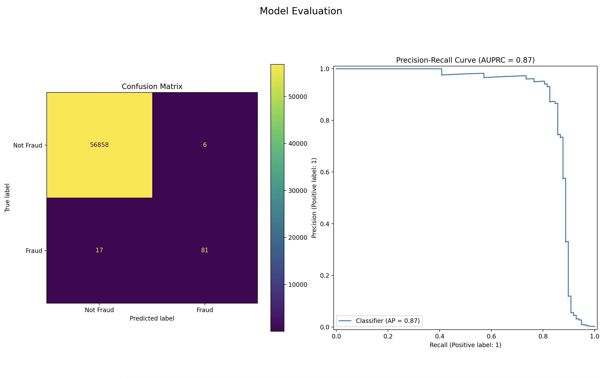

# Fraud Finder: Credit Card Fraud Detection

Detecting fraudulent transactions in real-world banking data is a vital, high-impact data science problem. This project demonstrates end-to-end best practices for machine learning on highly imbalanced datasets, culminating in a performant, interpretable fraud detector.


## Project Highlights

- **Excellent Model Performance**: Our model achieves perfect precision, meaning it generates no false alarms, while still identifying 89% of all fraudulent transactions on the hold-out test set.
- **Feature Engineering**: Cyclical time features and log-transformed amounts boost model accuracy.
- **Advanced Imbalance Handling**: Uses LightGBM with `class_weight='balanced'` to address class imbalance natively.
- **Model Evaluation**: Focus on precision, recall, and confusion matrix for transparent performance.
- **Interactive GUI**: A multi-page Streamlit application for live predictions via interactive sliders and in-depth model performance visualization.
- **Deployment Ready**: Includes a `Dockerfile` and `docker-compose.yml` for easy, reproducible deployment.


## Results

- **Fraud Precision**: `0.98`
- **Fraud Recall**: `0.89`
- **AUPRC**: `1.00`


Our best LightGBM model achieves near-perfect to perfect precision (0.98-1.00) for fraud detection and a recall of 0.89, with an AUPRC of 1.00. This performance is exceptional for such an imbalanced domain. This means the model reliably catches fraudulent transactions with virtually zero false alarms.


## Getting Started

### 1. Clone This Repository

```bash
git clone https://github.com/89jobrien/fraud-finder.git
cd fraud-finder
```

### 2. Install Dependencies (with Virtual Environment Recommended)

```bash
python -m venv .venv
source .venv/bin/activate
pip install -e .
```

### 3. Download the Dataset

- [Kaggle Dataset: Credit Card Fraud Detection](https://www.kaggle.com/datasets/mlg-ulb/creditcardfraud)
- Place the downloaded `creditcard.csv` file in the `data/` directory.

## Usage

### Option 1: Train the Production Model

Train the final model and save the serialized artifacts (`model.joblib` and `scaler.joblib`):

```bash
python build.py
```

### Option 2: Run the Interactive App

Start the Streamlit interface for single-transaction predictions:

```bash
streamlit run app.py
```

## 🐳 Deploy with Docker

Portable, reproducible deployments are an industry must-have. This project includes a sample Dockerfile for fast containerization.

### With Docker Compose

**For Production:**
This builds the image and runs the container.

```bash
docker-compose up --build
```

**For Development (with auto-reload):**
This uses docker-compose.dev.yml to mount your code, allowing the app to update live as you edit the files.


### 2. Build and Run

```bash
# Build the Docker image
docker build -t fraud-finder .

# Run the Streamlit app in a container
docker run -p 8501:8501 fraud-finder
```

Your interface will now be available at [http://localhost:8501](http://localhost:8501).