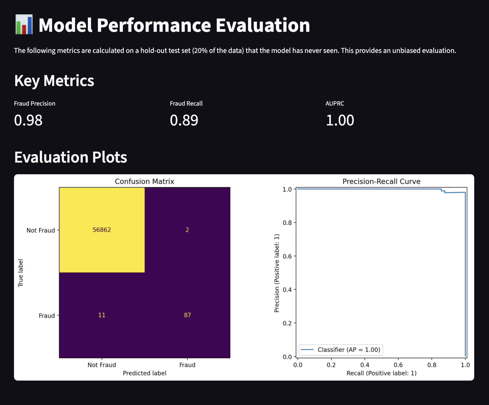

# Fraud Finder: Credit Card Fraud Detection

Detecting fraudulent transactions in real-world banking data is a vital, high-impact data science problem. This project demonstrates end-to-end best practices for machine learning on highly imbalanced datasets, culminating in a performant, interpretable fraud detector.


## Project Highlights

- **Feature Engineering**: Cyclical time features and log-transformed amounts boost model accuracy.
- **Advanced Imbalance Handling**: Uses LightGBM with `class_weight='balanced'` to address class imbalance natively.
- **Model Evaluation**: Focus on precision, recall, and confusion matrix for transparent performance.
- **Interactive Interface**: Streamlit app (`app.py`) for live predictions and visualization of model performance.


## Results

- **Fraud Precision**: `0.94`
- **Fraud Recall**: `0.83`
- **AUPRC**: `0.87`


These metrics reflect a model that flags fraudulent activity accurately and with minimal false positives—a critical requirement for real-world fraud detection systems.


## Getting Started

### 1. Clone This Repository

```bash
git clone https://github.com/89jobrien/fraud-finder.git
cd fraud-finder
```

### 2. Install Dependencies (with Virtual Environment Recommended)

```bash
python -m venv .venv
source .venv/bin/activate
pip install -e .
```

### 3. Download the Dataset

- [Kaggle Dataset: Credit Card Fraud Detection](https://www.kaggle.com/datasets/mlg-ulb/creditcardfraud)
- Place the downloaded `creditcard.csv` file in the `data/` directory.

## Usage

### Option 1: Train the Production Model

Train the final model and save the serialized artifacts (`model.joblib` and `scaler.joblib`):

```bash
python build.py
```

### Option 2: Run the Interactive App

Start the Streamlit interface for single-transaction predictions:

```bash
streamlit run app.py
```

## 🐳 Deploy with Docker

Portable, reproducible deployments are an industry must-have. This project includes a sample Dockerfile for fast containerization.

### 1. Create a `Dockerfile` in the Project Root

```dockerfile
# Use an official Python runtime as a parent image
FROM python:3.12-slim

WORKDIR /app

COPY pyproject.toml .
RUN pip install uv && uv pip install --system .

COPY . .

RUN python build.py

EXPOSE 8501

CMD ["streamlit", "run", "app.py", "--server.port=8501", "--server.address=0.0.0.0"]
```

### 2. Build and Run

```bash
# Build the Docker image
docker build -t fraud-finder .

# Run the Streamlit app in a container
docker run -p 8501:8501 fraud-finder
```

Your interface will now be available at [http://localhost:8501](http://localhost:8501).